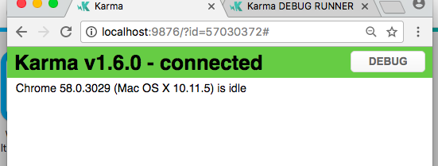
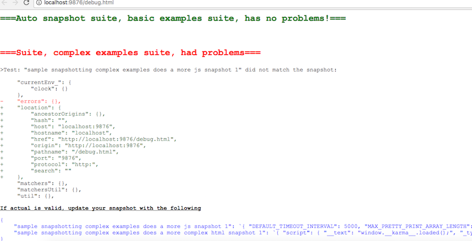

# jasmine-snapshot
This allows you to compare snapshots to html or javascript objects, and gives a diff when they don't match - similar to what jest snapshots do. The purpose of this library is to take away the effort of making "expected" results for your test.

I made this library because my company needed to be able to test on a browser, and facebook's jest (which has snapshots) does not allow you to do this.

As of version 1.7, this library will make managing snapshots much easier. Now you get an in browser summary of the diff between the actual and the snapshot. Also, you don't have to store your own snapshots as it will create the entire snapshot file and you just need to copy and paste the final results where ever you want to store the snapshots.

# Basic Strings
The most basic feature is to compare a string to a snapshot. This isn't very useful on its own but if it fails, it will give a nice diff between the two strings in the output log.

```ts
import { MatchesSnapshot } from "jasmine-snapshot";

it("matces simple snapshot", () => {
    let actual = "fried chicken";

    // do stuff . . .

    let snapshot = "fried chicken";
    MatchesSnapshot(snapshot, actual);
});

```

# Javascript objects
The much more useful feature is to compare javascript objects to a snapshot. It will take any JS object, remove circular references, and stringify the JS object. Then it will prettify both the snapshot and the actual JS stringified object. If they don't match, it will give you a diff of the two prettified JSON strings and tell you what to put in your snapshot if you want to update it.

The first thing you need to do is register a snapshot object to use and give it a name:

```ts
let snapshots = {
    
};
        
beforeAll(() =>
{
    registerSnapshots(snapshots, "snapshot suite name");
});
```

Note you can only have one registered snapshot object at a time at this point. So you can put them on the base describes or register a snapshot file before any test run for all your test (though this snapshot objects will get huge if you do this.) Generally I put the snapshot object in it's own file.

Here is an example of a successfully matching compares assuming you have registered a snapshot object and updated it.

```ts
import { expectjs, registerSnapshots, expectxml } from "jasmine-snapshot";

it("matces JS snapshot ", () =>
{
    let actual = { chicken_type: "fried" };
    expectjs(actual).toMatchSnapshot();
});
```

# XML/HTML objects
Also, you can do checks with XML and XML'ish type things.
Note that the snapshot is JSON formed from the HTML. That is because the JSON can be ordered alphabetically so the order of HTML tag attributes will not affect the result.

```ts
it("does a basic html snapshot", () =>
{
    let actual = `<div id="freddy" class="ribbit frogs"><span>hails yeahs</span></div>`;

    expectxml(actual).toMatchSnapshot();
});
```

Here is an example checking HTML generated by react checked using Enzyme.

```ts
import * as React from "react";
import * as Enzyme from "enzyme";
import { FormControl } from "react-bootstrap";
import { expectjs, registerSnapshots, expectxml } from "jasmine-snapshot";

it("Render basic text area with bootstrap ", () =>
{
    const elem = Enzyme.shallow(
        <FormControl componentClass="textarea" value={"aoeu"} />
    );

    expectxml(elem.html()).toMatchSnapshot();
});
```

See the example-test.ts for more examples.

# Managing snapshots
Unlike jest, this library requires some managing of the snapshots yourself to some degree. If you run the example-test.ts test right now, some snapshots will match while others will fail to match.

To see the results, click the debug button on the browser that karma opens.



Then you should see the following results:



You can see here that it gives you a nice diff of the differences between the snapshot and the actual.

If you want to update your snapshots you must copy and paste the blue snapshots to your snapshot location. See example-test.ts for more details.
